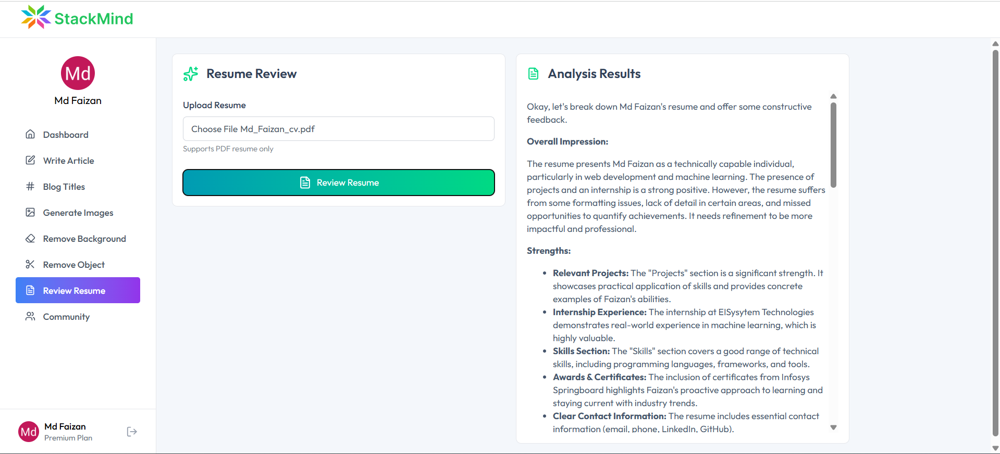

# StackMind

An AI-powered content and image generation app built with React (Vite) and an Express backend. Features include generating articles, blog titles, AI images, resume reviews, and image background/object removal. Authentication and usage limits are managed via Clerk; storage via Cloudinary; data via Neon/Postgres.

### Live Demo
- Frontend: [[Live Site])
- API Base URL: `https://your-live-backend-url.com/api`

### Screenshots
- Home / Hero
  
  

- Dashboard
  
  

- Generate Article
  
  

- Generate Title
  
  

- Generate Image
  
  

- Remove Background 
  
  

- Remove Background Object
  
  

- Resume Reviewer
  
  

- Community
  
  

### Tech Stack
- **Frontend**: React 19, Vite 7, Tailwind CSS 4, React Router, Axios, Clerk React, React Markdown, React Hot Toast
- **Backend**: Express 5, Clerk Express, Neon serverless Postgres, Cloudinary, Multer, OpenAI SDK (Gemini endpoint), pdf-parse

---

## Monorepo Layout
- `client/` — Vite/React app
- `server/` — Node/Express API

---

## Prerequisites
- Node.js 18+ and npm
- Accounts and credentials for:
  - Clerk (auth)
  - Neon/Postgres (database)
  - Cloudinary (asset storage)
  - Google AI Studio (Gemini API via OpenAI-compatible endpoint) or equivalent
  - Clipdrop API (text-to-image)

---

## Environment Variables
Create `.env` files for both `client/` and `server/` directories.

### server/.env
- `PORT=3000`
- `CLERK_SECRET_KEY=...` (required by `@clerk/express`)
- `DATABASE_URL=...` (Neon Postgres connection string)
- `CLOUDINARY_CLOUD_NAME=...`
- `CLOUDINARY_API_KEY=...`
- `CLOUDINARY_API_SECRET=...`
- `GEMINI_API_KEY=...` (used by OpenAI SDK with Gemini base URL)
- `CLIPDROP_API_KEY=...`

### client/.env
- `VITE_CLERK_PUBLISHABLE_KEY=...` (frontend Clerk key)

Note: We use a Vite dev proxy for API calls, so you do NOT need to set a frontend base URL for Axios in development.

---

## Install & Run

### 1) Install dependencies
- From repo root:
  - `cd server && npm install`
  - `cd ../client && npm install`

### 2) Start Backend (Express)
- From `server/`:
  - Development with auto-reload: `npm run server`
  - Production: `npm start`
- API will run on `http://localhost:3000`

### 3) Start Frontend (Vite)
- From `client/`:
  - `npm run dev`
- App served at `http://localhost:5173`

---

## Dev Proxy (Important)
In `client/vite.config.js`, we forward API calls to the backend:
```js
server: {
  proxy: {
    '/api': {
      target: 'http://localhost:3000',
      changeOrigin: true,
      secure: false,
    }
  }
}
```
- Make all frontend requests using relative paths like `/api/ai/generate-article`.
- Do NOT set `axios.defaults.baseURL` in the frontend for development.
- Restart the Vite dev server after changing proxy settings.

---

## Scripts

### client
- `npm run dev` — Start Vite dev server
- `npm run build` — Build production assets
- `npm run preview` — Preview production build
- `npm run lint` — Lint project

### server
- `npm run server` — Start with nodemon
- `npm start` — Start Node server

---

## Backend API
Base URL during development: `http://localhost:3000/api`

All AI routes are mounted under `/api/ai` and require auth via Clerk middleware in each route.

- POST `/api/ai/generate-article`
  - Body: `{ prompt: string, length: number }`
  - Returns: `{ success: boolean, content?: string, message?: string }`

- POST `/api/ai/generate-blog-title`
  - Body: `{ prompt: string }`
  - Returns: `{ success: boolean, content?: string, message?: string }`

- POST `/api/ai/generate-image`
  - Body: `{ prompt: string, publish?: boolean }`
  - Returns: `{ success: boolean, content?: string (imageUrl), message?: string }`

- POST `/api/ai/resume-review`
  - Multipart: `resume` (PDF)
  - Returns: `{ success: boolean, content?: string, message?: string }`

- POST `/api/ai/remove-image-background`
  - Multipart: `image`
  - Returns: `{ success: boolean, content?: string (imageUrl), message?: string }`

- POST `/api/ai/remove-image-object`
  - Multipart: `image`
  - Body: `{ object: string }`
  - Returns: `{ success: boolean, content?: string (imageUrl), message?: string }`

User routes are mounted under `/api/user` and also require auth:
- GET `/api/user/get-user-creations`
- GET `/api/user/get-published-creations`
- POST `/api/user/toggle-like-creation`

---

## Authentication & Usage Limits
- Clerk is used for authentication.
- Middleware infers plan and tracks `free_usage` in Clerk user `privateMetadata`.
- Non-premium users have limited free usage; premium users have unrestricted access for supported features.

---

## Data & Storage
- Postgres (Neon) stores generated content metadata in a `creations` table.
- Cloudinary stores images (generated or transformed) and returns accessible URLs.

---

## Frontend Notes
- Axios is used directly with relative API paths (e.g., `axios.post('/api/ai/generate-article', ...)`).
- Clerk React is used to obtain Bearer tokens for protected endpoints.
- Tailwind CSS 4 for styling; React Markdown for rich text rendering.

---

## Troubleshooting
- 404 on AI routes in development
  - Ensure Vite proxy is present (see Dev Proxy above) and Vite server restarted
  - Ensure backend is running on port 3000
  - Use relative URLs (`/api/...`) in the frontend

- 401/403 unauthorized
  - Verify Clerk keys are configured: `CLERK_SECRET_KEY` (server) and `VITE_CLERK_PUBLISHABLE_KEY` (client)
  - Ensure token is attached: `Authorization: Bearer <token>` in frontend requests

- Image upload errors
  - Confirm Cloudinary credentials and that the account supports the used transformations
  - Check multipart field names: `image`, `resume`

- Gemini/OpenAI errors
  - Verify `GEMINI_API_KEY` and that the base URL is set to `https://generativelanguage.googleapis.com/v1beta/openai/`

- Database issues
  - Verify `DATABASE_URL`
  - Ensure the `creations` table exists with required columns

---

## Production Considerations
- Serve frontend from a static host (e.g., Vercel/Netlify) and point API to your deployed backend URL.
- In production, configure the frontend to use absolute API base URL if not using a reverse proxy.
- Secure environment variables; never commit `.env` files.
